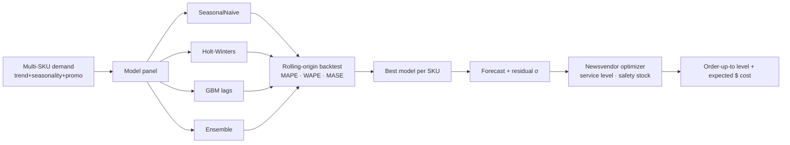

# 📦 AtlasForecast — Forecasting + Inventory-Optimization Decision Engine

[](https://github.com/akshay-birla-03/atlas-forecast/actions)
[](#)
[](#)
[](LICENSE)

**AtlasForecast** doesn't just predict demand — it decides **what to order**. It runs a
panel of forecasting models, picks the best per SKU with **rolling-origin backtesting**,
then feeds the forecast + its uncertainty into a **newsvendor inventory-optimization** layer
that outputs order quantities, safety stock and the **expected cost** of each decision.

That's the difference that matters to a business: not *"demand will be ~400 units"* but
**"order 447 units to hit a 96% service level at the lowest expected cost."**

> Inter-domain by design: **time-series DL + classical ML + statistics + operations research
> + business analytics.** Runs fully offline with only `numpy` + `scikit-learn`.

## Why it's interesting

- **A panel of models, chosen honestly.** SeasonalNaive (baseline), **Holt-Winters** (triple
  exponential smoothing, hand-implemented in numpy), a **gradient-boosted** lag-feature model,
  and an **ensemble** — ranked per SKU by **rolling-origin backtest** (no future leakage).
- **MASE, not just MAPE.** Errors are scaled against the in-sample seasonal-naive error, so a
  score below 1 provably beats naive.
- **Forecasts become decisions.** The newsvendor model converts unit economics (margin vs.
  holding/obsolescence cost) into an optimal **service level → safety stock → order-up-to
  level**, with an expected-cost estimate via the normal loss function.
- **Uncertainty-aware.** Order quantities scale with forecast residual volatility, not just
  the point forecast.

## Architecture



## Quickstart

```bash
git clone https://github.com/akshay-birla-03/atlas-forecast.git && cd atlas-forecast
python -m venv .venv && source .venv/bin/activate
pip install -e ".[dev]"

atlasforecast backtest          # rank models per SKU
atlasforecast plan              # full forecast → order recommendations
pytest -q
```

### Example output

```json
{
  "model_selection": {"SKU_00": "gbm", "SKU_01": "gbm"},
  "plans": [{
    "sku": "SKU_00", "chosen_model": "gbm",
    "recommendation": {
      "demand_mean": 401.31, "demand_std": 25.86,
      "target_service_level": 0.9615, "safety_stock": 45.75,
      "order_up_to_level": 447.06, "expected_cost": 46.04
    }
  }],
  "total_expected_cost": 86.68
}
```

## Business read-out

| Output | What a planner does with it |
|--------|-----------------------------|
| `target_service_level` | the cost-optimal % of demand to cover (derived, not guessed) |
| `safety_stock` | buffer against forecast error over the lead time |
| `order_up_to_level` | the number to actually order |
| `expected_cost` | projected cost of the stockout/overstock trade-off |

## Project layout

```
src/atlasforecast/
  data.py        synthetic multi-SKU demand generator
  models.py      SeasonalNaive · Holt-Winters · GBM · Ensemble
  metrics.py     MAPE · WAPE · RMSE · bias · MASE
  backtest.py    rolling-origin CV + model selection
  inventory.py   newsvendor optimizer (order-up-to, safety stock, cost)
  pipeline.py    generate → backtest → select → plan
tests/           models, metrics, newsvendor economics, end-to-end
```

## Roadmap

- LSTM / Temporal-Fusion forecaster behind the `dl` extra
- Probabilistic forecasts (quantiles) feeding a chance-constrained order policy
- Multi-echelon inventory and supplier lead-time distributions
- Streamlit executive dashboard (`ui` extra)

## License

MIT © Akshay Birla
